# Table of Contents

- [Table of Contents](#table-of-contents)
- [Introduction](#introduction)
- [Install Docker](#install-docker)
  - [Recommendations](#recommendations)
- [Initial Setup](#initial-setup)
- [Usage](#usage)
- [Known Issues](#known-issues)
- [Contact](#contact)

# Introduction

This repository is built with [Docker](https://docs.docker.com/?_gl=1*jirhkt*_gcl_aw*R0NMLjE3Mjk3MTE0OTEuRUFJYUlRb2JDaE1JMVB1ZHRwMmxpUU1WRFU3X0FSMDFfZzVPRUFBWUFTQUFFZ0tsOFBEX0J3RQ..*_gcl_au*MjEwMDM5OTQxNS4xNzI3MTExOTkz*_ga*MzI1MTgxNzg4LjE3MjcxMTA2OTA.*_ga_XJWPQMJYHQ*MTczNDAyOTUzOS4yMy4xLjE3MzQwMjk3ODUuNDcuMC4w) to allow the code to run on a Ubuntu 22.04 image with ROS2 Humble LTS and all necessary dependencies, regardless of the user's operating system.

# Install Docker

## Docker Installation

For Docker installation, follow these instructions:
- [Docker Windows](https://docs.docker.com/desktop/setup/install/windows-install/)

Once Docker is installed, ensure the Docker Desktop application remains open throughout the process.

# Initial Setup

## Setup WSL

To access UI applications from a Dev Container on Windows, follow these steps:

1. Install the Ubuntu application from the [Microsoft Store](https://apps.microsoft.com/detail/9pdxgncfsczv?hl=en-US&gl=US)

2. Open a Command Prompt (Windows Key + "cmd")

    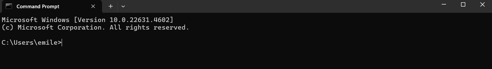

3. Verify Ubuntu installation:
   ```bash
   wsl --list
   ```
   
   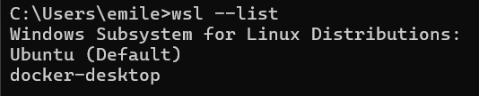

4. If Ubuntu is not the default, set it as default:
   ```bash
   wsl --set-default Ubuntu
   wsl --shutdown
   ```

   > **Note**: If Ubuntu is not in the list, additional configuration may be required.

5. Open Ubuntu terminal by typing the following command in the Command Prompt terminal:
   ```bash
   bash
   ```

6. Navigate to the "docker" folder and run Docker Compose:
   ```bash
   cd /path/to/docker/folder
   docker-compose -f docker-compose.yml -f docker-compose.override.wsl.yml up
   ```

   The command should have the following result

   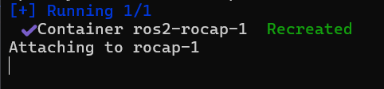

## Setup Repository in Visual Studio Code

1. Open the source code in VSCode, selecting the folder with the `.devcontainer` folder visible:

   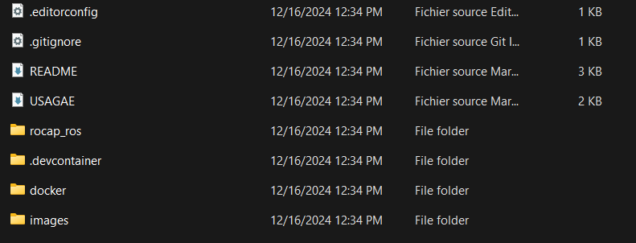

2. Install required extensions:
   
   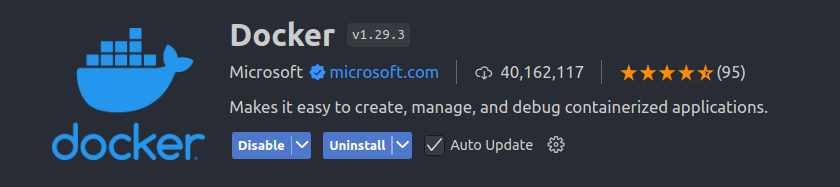
   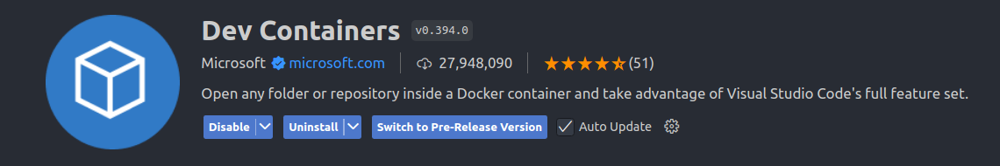

3. Reopen the workspace in a Dev Container:
   - Use the popup upon opening
   
     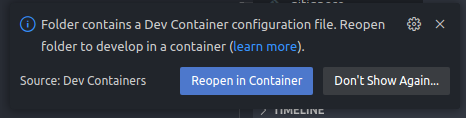

   - Or manually:
     - Click the blue button in the bottom left
     
       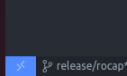
     
     - Select "Reopen in Container"
     
       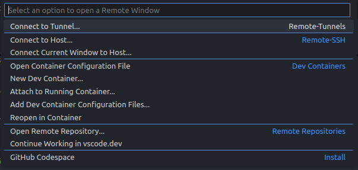

4. Once in the Dev Container, run the build script:
   ```bash
   ./build.bash
   ```

# Usage

## Launch

The ROS2 environment for the Rocap supports multiple simulation configurations:

Before launching the Rocap, run the following command in the terminal:

   ```bash
   source install/setup.bash
   ```

1. Complete simulation (odometry and lidar simulated):
   ```bash
   ros2 launch rocap_ros rocap.launch.py
   ```
   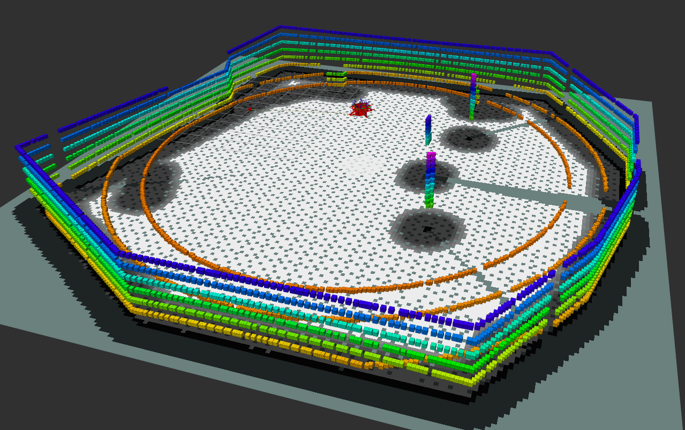

   > **Note**: the launching of the simulation may take a while. If no lidar data appears after 2 minutes, refer to the [Known Issues Tab](#known-issues) for more information   

2. API bridge with Lidar integration:
   ```bash
   ros2 launch rocap_ros rocap.launch.py sim:=false velodyne:=true
   ```
2. Lidar integration with simulated odometry:
   ```bash
   ros2 launch rocap_ros rocap.launch.py sim:=false velodyne:=true
   ```

   <!--  -->

> **Note**: Other configurations are possible but may require additional testing.

## Controlling the robot

The rocap can be controlled one of 2 ways.

1. Control via NAV2

   To control the rocap with NAV2, go the the RVIZ page and click on the "2D Goal Pose" button as showd in the image bellow

   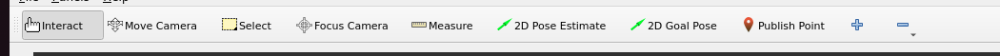

   Once the button is selected, click on any point on the map and the Rocap will generate a 2D path to the desired position. Should yield the following result:

   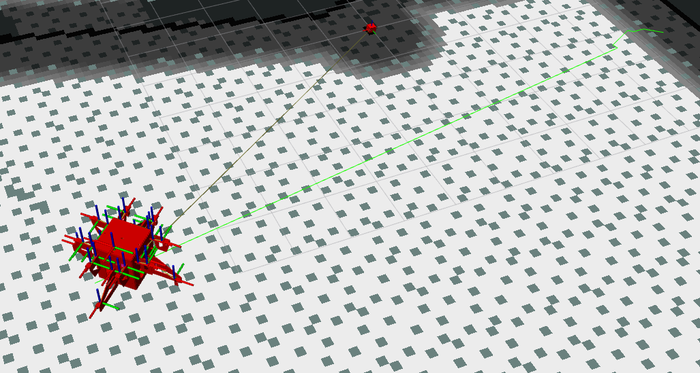

2. Control via keyboard teleoperation

   To control the Rocap with your keyboard, run the following command in a terminal:

   ```bash
   ros2 run teleop_twist_keyboard teleop_twist_keyboard 
   ```

   You can then follow the instructions on the terminal screen to control the Rocap.

# Known Issues

## Simulation
When opening the Rocap in simulation, the following are known issues to this repository:

1. Rocap not reaching desired position in Gazebo

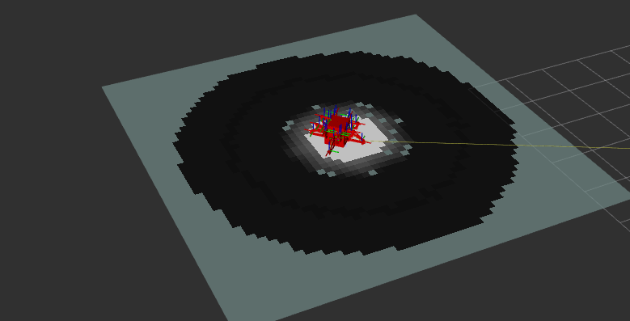

2. Simulated lidar out of sync

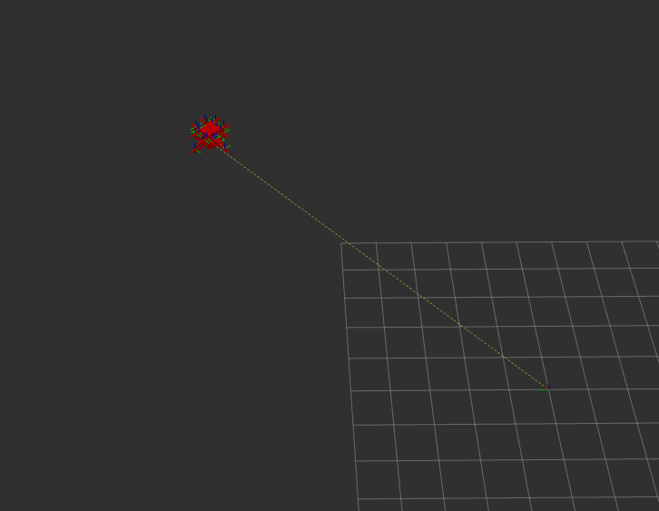

When encountering these issues, simply reboot the simulation.
## Real Rocap
> **Note**: These issues have been documented but not fixed

When launched with the following configuration:
   ```bash
   ros2 launch rocap_ros rocap.launch.py sim:=false velodyne:=true
   ```
The rocap currently has an issue with the transformation of the Map TF. This leads to not being able to control the robot from RVIZ and request a path. There is also a displacement of the /Odom frame in accordance to the /Map frame which renders the lidar data untreatable.

# Contact

This code was developed by the Cégep Édouard-Montpetit under grant 22CTA034.